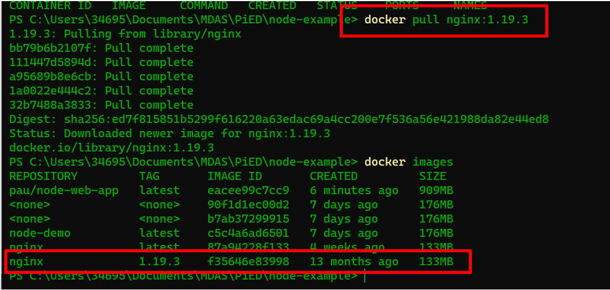

# Ejercicio 3 .Crea un contenedor con las siguientes especificaciones: 

# a. Utilizar la imagen base NGINX haciendo uso de la versión 1.19.3

Primero lo que he hecho es bajar la imagen de nginx 1.19.3 con el comando **docker pull nginx:1.19.3**
Con el comando **docker images** puedo ver la imagen descargada.

En este momento puedo correr un contenedor y ver si nginx funciona. Para hacerlo he utilizado el comando **docker run -i -t –name nginx -p 8080:80 nxing**

Una vez el tengo el contenedor corriendo puedo ver en la dirección 8080/index.html el fichero.

# b. Al acceder a la URL localhost:8080/index.html aparecerá el mensaje HOMEWORK 1 

Para que al acceder a la url /index.html aparezca el mensaje primero he creado un simple fichero index.html con el mensaje.

Después he generado un Dockerfile con el siguiente contenido:

Cojo la imagen de nginx:1.19.3 y luego copio mi index.html en la ruta /urs/share/nginx/html. Lo copio en esta ruta, ya que es donde por defecto Nginx mira dentro del contenedor para servir imágenes.

Una vez tengo el dockerfile hago un build de la imagen con el comando **docker build -t nginx-html .**

Una vez tengo la imagen lo que hago es iniciarla con el comando **docker run -d -p 8080:80 nginx-html**

# c. Persistir el fichero index.html en un volumen llamado static_content

Para persistir el fichero html en la imagen hay que crear un volumen. Para eso hay que generar un volumen con el comando docker volume create static_content.

He iniciado el contenedor con el volumen con el comando **docker run -d -p 8080:80 -v static_content:/etc/tododata nginx-html** y de esta manera le digo que el volumen static_content persistirá los datos en /etc/tododata.
Después he entrado en el contenedor con el comando docker exec -it practical_lichterman sh siendo practical_lichterman el nombre que se ha asignado a mi contenedor.
Una vez dentro he copiado el archivo html aprovechando la ruta donde se guarda el fichero html para visualizarlo en 8080/index.html en la imagen de nginx que es /user/share/nginx/html y lo he copiado en la ruta del volumen, es decir /etc/tododata.

Ahora que tengo los datos en el volumen voy a entrar en un contenedor nuevo con la imagen de nginx-html pasándole el volumen para ver si está el archivo index.html en etc/tododata/

Y aquí tenemos el archivo index.html.

