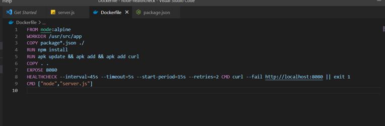

# Ejercicio 4

Primero de todo voy a hacer una imagen con una aplicación con node que expone un servicio en el puerto 8080. Para ello he utilizado esta fase inicial del Dockerfile.

He puesto la imagen de node:alpine, creo y accedo al directorio usr/src/app, copy el Package json que tengo en mi host para pegarlo al contenedor, hago un run install para que se instalen las dependencias y luego run de apk update, apk add y apk add curl, luego copio toda mi carpeta dentro del contenedor, expongo el endpoint en el puerto 8080 y le hago lanzo con el CMD.

Con este Dockerfile genero la imagen con el comando **docker build -t node-healthcheck**.

Y corro la imagen en un contenedor con **docker run -p 8080:8080 -d node-healthcheck**

Ahora tengo el servicio en el Puerto 8080.

En la ruta 8080/ la aplicación simulará que no funciona y en la ruta /health nos responderá diciendo que esta alive.

• La prueba se realizará cada 45 segundos
• Por cada prueba realizada, se esperará que la aplicación responda en menos de 5 segundos. Si tras 5 segundos no se obtiene respuesta, se considera que la prueba habrá fallado
• Ajustar el tiempo de espera de la primera prueba (Ejemplo: Si la aplicación del contenedor tarda en iniciarse 10s, configurar el parámetro a 15s)
• El número de reintentos será 2. Si fallan dos pruebas consecutivas, el contenedor deberá cambiar al estado “unhealthy”)

Como tenemos un endpoint que no funciona y deja la aplicación sin funcionar podemos hacer uso de un healthcheck para arreglar este caso y dejar el contenedor en unhealthy.:
Para configurar el heathcheck hay que utilizar el comando:
HEALTHCHECK –interval=? –timeout=? –start-period=? –retires=?
En este caso con las configuraciones que nos piden en el ejercicio el Dockerfile quedaría de esta manera:

El comando curl hace un check de sí la aplicación está corriendo haciendo una petición al endpoint 8080/. Si nos devuelve un 200 devuelve exit 0, si la aplicación falla devuelve exit -1.

Vuelvo a crear la imagen y hago run de otro contenedor.

Utilizando **docker ps** puedo ir mirando el status de la aplicación.
Con el comando **docker inspect –format “{{json .State.Health }}” nombre_contenedor | jq**, puedo ver los logs del healthcheck. Podemos observar que se ha hecho una comprobación al endpoint 8080/ y que este falla, dejando el status del contenedor en unhealthy.

Se puede observar que las llamadas al endpoint responden con un ExitCode: -1.

Al hacer un docker ps podemos observar que el estado es unhealty.

Ahora voy a poner que el Healthcheck compruebe el endpoint 8080/health para observar la diferencia. Voy a volver a generar la imagen y levantar un contenedor.

En este caso podemos observar que cuando lanzo el comando en el segundo 14 aún no hay peticiones del healthcheck, y unos segundos después se puede ver que la llamada al endpoint ha respondido y muestra el contenido del endpoint /health.

