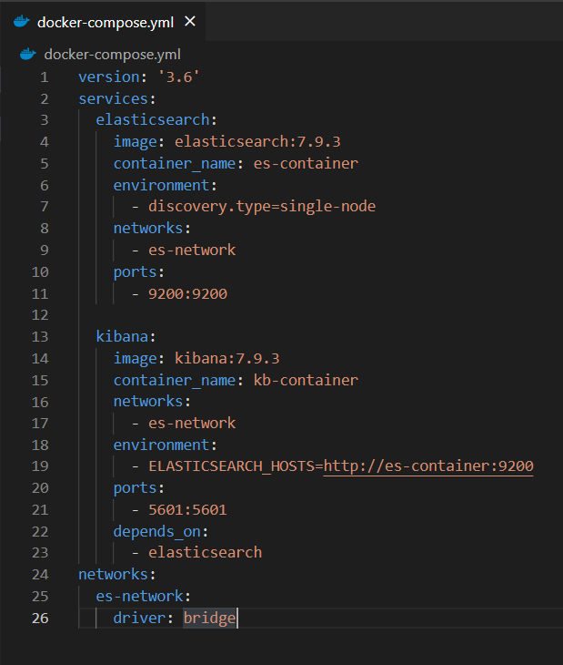
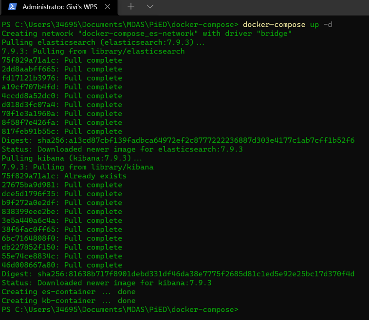
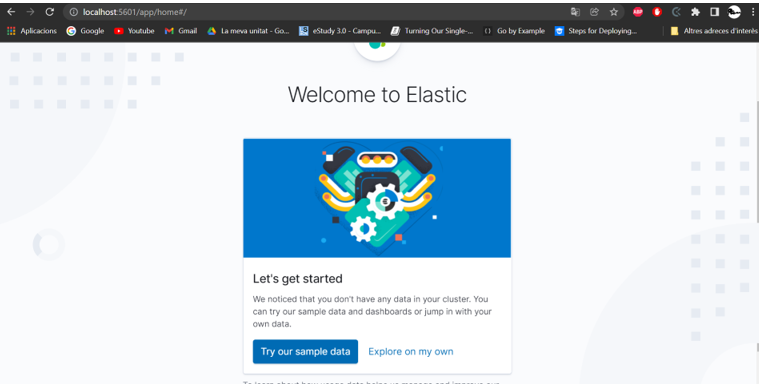
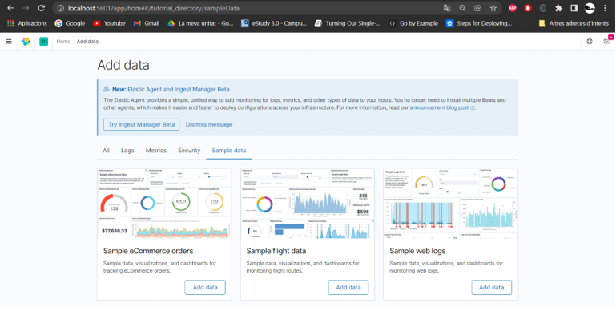
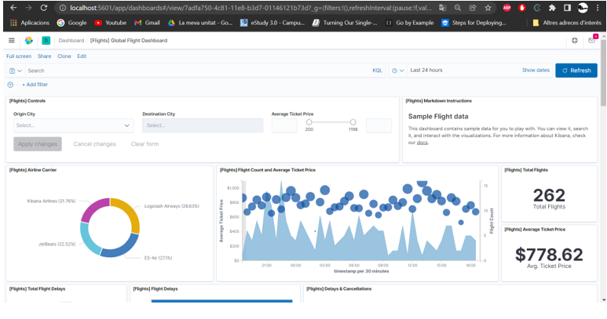

# Ejercicio 5

He rellenado el fichero de docker-compose-yml con la siguiente configuración.

Despues utilitzo el comando **docker compose up -d** para lanzar el docker-compose.yml

Me crea la network, se baja las imagenes de elasticsearch y kibana, y crea los dos contendores.

Si ahora accedemos a http://localhost:5601 tenemos lo siguiente:

Le doy a add data y luego a view data con dashboard:

